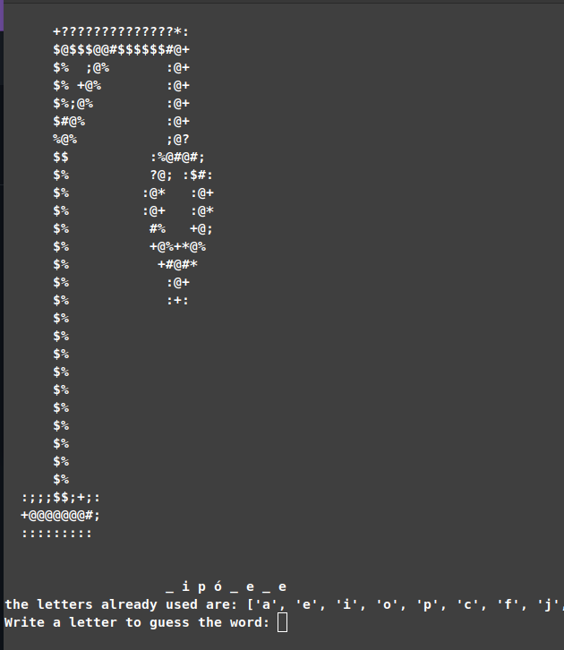

# Hangman with words in portuguese 🎮

Code to run hangman with words in portuguese (more than 2000 words)

## How to run it
To run the code please clone the repository to your local machine

Then, in the terminal in the main directory of the repository run

If you are using linux with zshell

    python3 run_game.py
    
    

then start playing.🏆

### License: MIT

